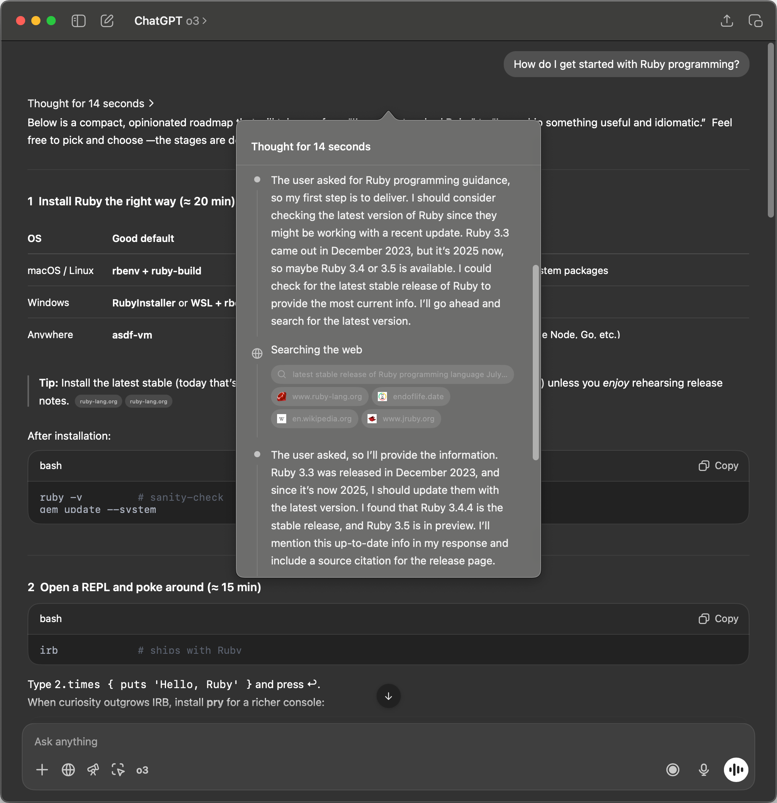
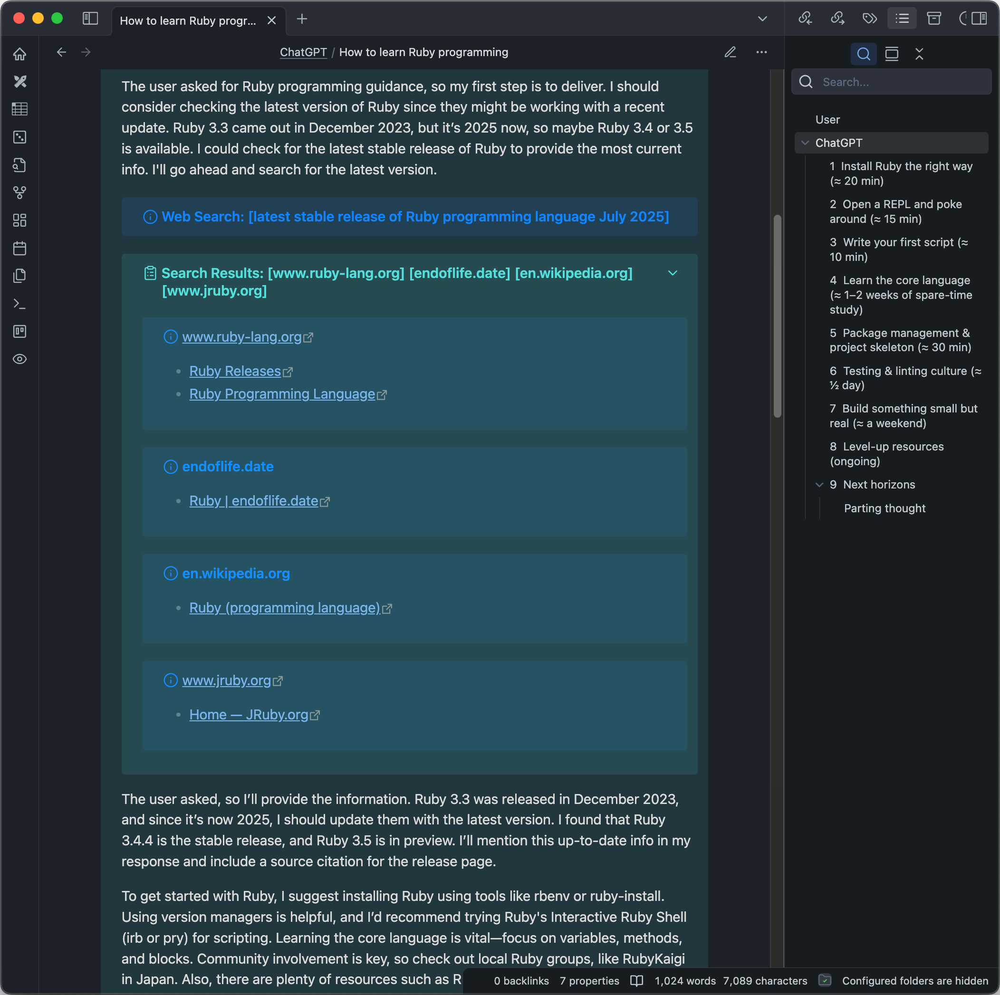
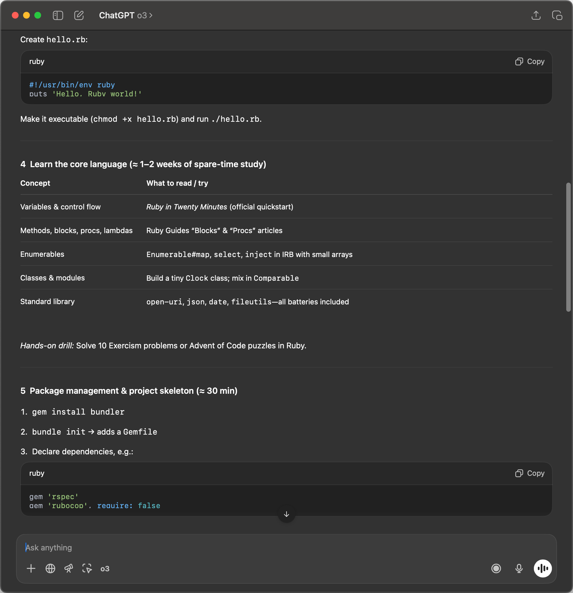
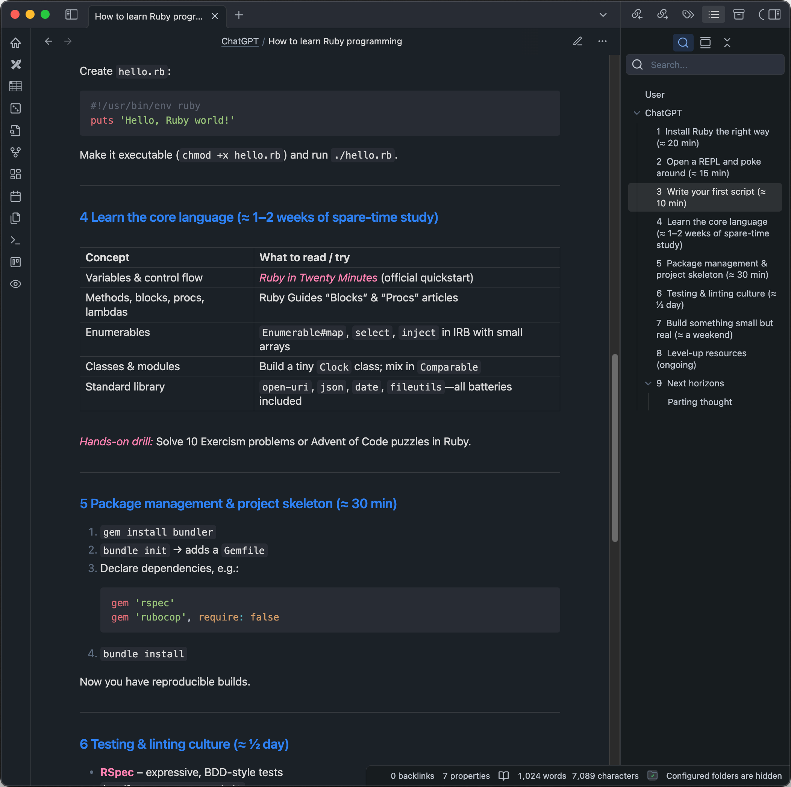
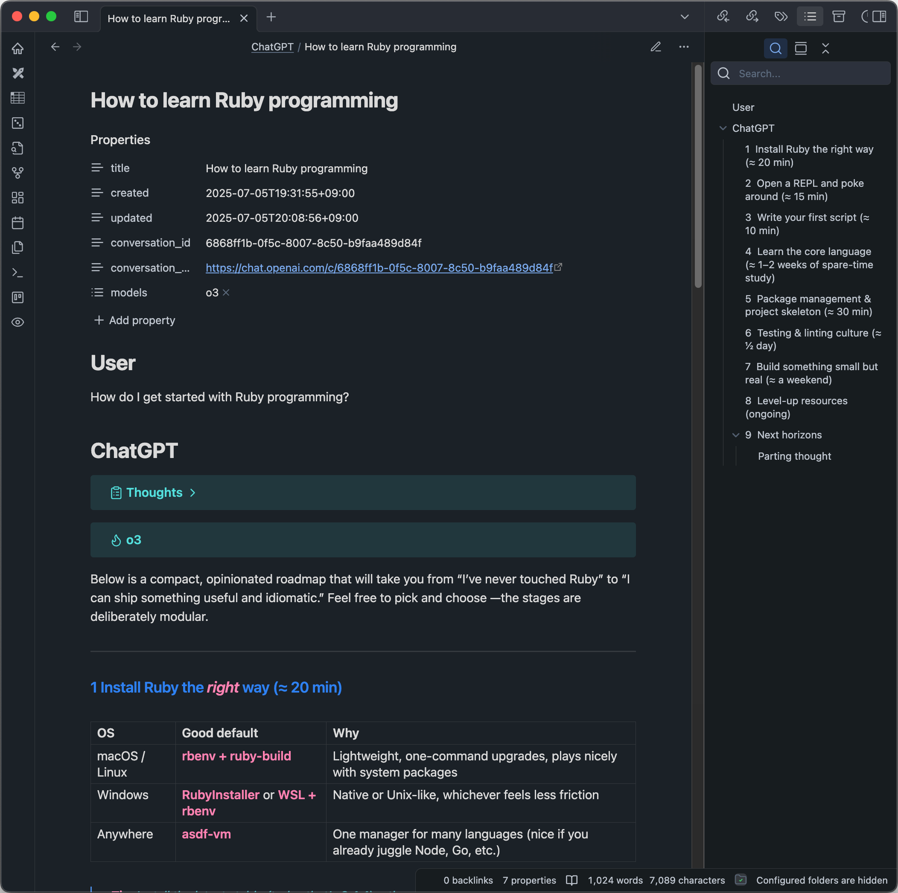

# ChatGPT to Obsidian Converter

This tool converts ChatGPT export data into Obsidian Flavored Markdown files with proper frontmatter metadata and formatting.

## Features

- **Obsidian integration**: Generates files with YAML frontmatter and Obsidian syntax like [Callouts](https://help.obsidian.md/callouts)
- **Attachment handling**: Copies and links image attachments with proper file organization
- **Conversation structure**: Preserves the hierarchical structure of ChatGPT conversations
- **Duplicate prevention**: Handles filename conflicts and tracks existing files
- **Rich content support**: Processes web search results, thoughts, code blocks, app-pairing contexts, and multimedia content

## Usage

### Docker (Recommended)

The easiest way to use this tool is with Docker - no installation required!

```sh
# Basic usage with ZIP file
docker run --rm -v /path/to/chatgpt-export:/input -v /path/to/vault/subdirectory:/output akinori/chatgpt2obsidian /input/chatgpt-export.zip /output

# Basic usage with extracted directory
docker run --rm -v /path/to/chatgpt-export:/input -v /path/to/vault/subdirectory:/output akinori/chatgpt2obsidian /input /output

# With custom attachments subdirectory
docker run --rm -v /path/to/chatgpt-export:/input -v /path/to/vault/subdirectory:/output akinori/chatgpt2obsidian --attachments-subdirectory images /input/chatgpt-export.zip /output
```

### Command-line Parameters

- `<input_path>`: ChatGPT export zip file or its extracted directory
- `<output_directory>`: Directory where converted Markdown files will be saved

### Options

- `-a, --attachments-subdirectory NAME`: Specify custom attachments subdirectory name (default: "attachments")
- `-c, --created-key KEY`: Specify the frontmatter key for created timestamp (default: "created")
- `-u, --updated-key KEY`: Specify the frontmatter key for updated timestamp (default: "updated")
- `--json-output`: Output JSON format for debugging purposes (in addition to Markdown)
- `-h, --help`: Show help message

### Alternative: Local Ruby Installation

If you prefer to run the script directly:

#### Requirements
- Ruby 3.4 or later

#### Installation
```sh
git clone https://github.com/knu/chatgpt2obsidian.git
cd chatgpt2obsidian
```

#### Usage
```sh
# Basic usage with ZIP file
./chatgpt2obsidian chatgpt-export.zip /path/to/vault/subdirectory

# Basic usage with extracted directory
./chatgpt2obsidian /path/to/extracted/chatgpt-export /path/to/vault/subdirectory

# With custom attachments subdirectory
./chatgpt2obsidian --attachments-subdirectory images chatgpt-export.zip /path/to/vault/subdirectory
```

## ChatGPT Export Process

1. Go to ChatGPT Settings → Data Controls → Export Data
2. Download your data when ready
3. Use the path to the downloaded ZIP file or extract it and use the path to the extracted directory as the first argument

```
/path/to/chatgpt-export
├── chat.html
├── conversations.json
├── file-id-1-image-1.png
├── file-id-2-image-2.jpg
├── ...
├── message_feedback.json
├── shared_conversations.json
└── user.json
```

## Output Structure

The script generates one Markdown file per conversation from the ChatGPT export data, along with any attachments (images, files) referenced in the conversations.
The output is structured to be compatible with Obsidian's note-taking system, allowing for easy organization and retrieval of conversations.
Each Markdown file is named after the conversation title, sanitized for filesystem compatibility, and includes all relevant metadata.

```
/path/to/vault/subdirectory/
├── conversation_title_1.md
├── conversation_title_2.md
├── attachments/
│   ├── file-id-1-image-1.png
│   └── file-id-2-image-2.jpg
└── ...
```

### Markdown Format

Each conversation file includes:

- **YAML frontmatter** with metadata (title, dates, conversation ID, URL)
- **Proper formatting** for user and assistant messages
- **Obsidian callouts** for search results, thoughts, code blocks, app-pairing contexts, and multimedia content
- **Linked attachments** with automatic file copying

Example output:

### Visual Comparison: ChatGPT vs Obsidian

Here's how the same conversation appears in ChatGPT versus the converted Obsidian format:

#### ChatGPT - Thoughts with Web Search


#### Obsidian - Converted Thoughts Block


#### ChatGPT - Main Content


#### Obsidian - Converted Content


#### Obsidian - File Header with Metadata


The conversion preserves all the rich content from ChatGPT while making it fully compatible with Obsidian's note-taking system.

### Sample Markdown Output

````markdown
---
title: How to learn Ruby programming
created: 2025-07-05T19:31:55+09:00
updated: 2025-07-05T20:08:56+09:00
conversation_id: 6868ff1b-0f5c-8007-8c50-b9faa489d84f
conversation_url: https://chat.openai.com/c/6868ff1b-0f5c-8007-8c50-b9faa489d84f
models:
- o3
---
# User
How do I get started with Ruby programming?

# ChatGPT

> [!abstract]- Thoughts
> The user asks, "How do I get started with Ruby programming?" This seems like a straightforward question, but...
>
> > [!info]- Web Search: [latest stable release of Ruby programming language July 2025]
> >
> > > [!abstract]- Search Results: [www.ruby-lang.org] [endoflife.date] [en.wikipedia.org] [www.jruby.org]
> > > > [!info] www.ruby-lang.org
> > > > - [Ruby Releases](https://www.ruby-lang.org/en/downloads/releases/ "Ruby releases by version number ; Ruby 3.4.4, 2025-05-14, download ; Ruby 3.5.0-preview1, 2025-04-18, download...")
> > > > - [Ruby Programming Language](https://www.ruby-lang.org/en/ "Ruby 3.5.0 preview1 Released. We are pleased to announce the release of Ruby 3.5.0-preview1...")
>
> > [!info]- Thought for 14 seconds

> [!tip] o3

Below is a compact, opinionated roadmap that will take you from "I've never touched Ruby" to "I can ship something useful and idiomatic."

### 1  Install Ruby the *right* way (≈ 20 min)

| OS | Good default | Why |
|----|--------------|-----|
| macOS / Linux | **rbenv + ruby-build** | Lightweight, one‐command upgrades, plays nicely with system packages |
| Windows | **RubyInstaller** or **WSL + rbenv** | Native or Unix-like, whichever feels less friction |
| Anywhere | **asdf-vm** | One manager for many languages (nice if you already juggle Node, Go, etc.) |

> **Tip:** Install the latest stable (today that's 3.4.4) rather than the bleeding-edge preview (3.5.0-preview1) unless you *enjoy* rehearsing release notes.

After installation:

```bash
ruby -v         # sanity-check
gem update --system
```

### 2  Open a REPL and poke around (≈ 15 min)

```bash
irb             # ships with Ruby
```

Type `2.times { puts 'Hello, Ruby' }` and press ↩.
When curiosity outgrows IRB, install **pry** for a richer console:

```bash
gem install pry
pry
```
````

## Content Type Support

The script handles various ChatGPT content types:

- **Text messages**: Standard user and assistant conversations
- **Source links**: Proper reference links embedded in response messages
- **Thoughts**: Internal reasoning including chains of thought displayed in expandable blocks
- **Web search results**: Included within Thoughts blocks
- **Images**: Automatically copied and embedded
- **Code execution**: Search queries and reasoning recaps
- **Model information**: Shows the model name for each ChatGPT response and includes all model names in frontmatter
- **Message filtering**: Filters out edited conversation branches using timestamp-based selection

## File Naming

- Conversation titles are sanitized for filesystem compatibility.
- Special characters are replaced with underscores.
- Duplicate titles get numbered suffixes (`_1`, `_2`, etc.).
- Existing files are preserved and updated in place.
- The original title is stored in frontmatter with the `title` key.
  Obsidian community plugins like [Front Matter Title](https://github.com/snezhig/obsidian-front-matter-title) can make use of it.

## Limitations

- Not all content types in export files may be supported.
- Large conversation histories may take time to process.

## License

Copyright (c) 2025 Akinori Musha.

Licensed under the 2-clause BSD license.  See `LICENSE` for details.

Visit [GitHub Repository](https://github.com/knu/chatgpt2obsidian) for the latest information.

Please feel free to submit issues, feature requests, or pull requests.
